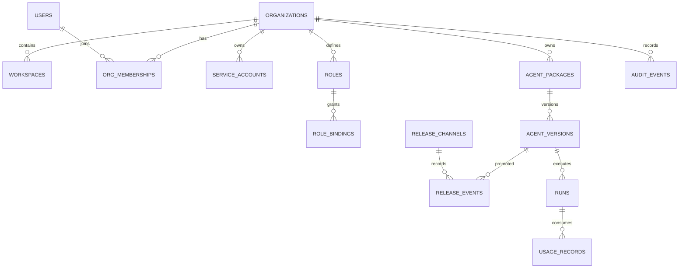

# DeerNexus MVP 数据模型

> 状态：实施草案  
> 数据库：PostgreSQL  
> 关联：[ADR-0002](../adr/0002-tenant-workspace-keys.md) · [运行时契约](runtime-contracts.md) · [API 边界](api-boundaries.md) · [90 天 MVP](../roadmap/90-day-mvp.md)

本文定义 90 天 MVP 所需的 Organization、身份授权、Agent 制品、发布、审计和用量模型，以及 DeerFlow 存量资源的 `org_id` 改造规则。实际表名需在 Fork 初始化后与上游 ORM/Alembic 对齐，但主键、归属、不变量和索引语义不得弱化。

---

## 1. 建模原则

1. Organization 是硬租户边界，租户资源 `org_id NOT NULL`。
2. Workspace 在 MVP 中可选，仅作资源分组，不提供 Workspace 级 RBAC。
3. 所有实体使用 UUID 主键；外部 API 将其视为不透明字符串。
4. 业务删除默认软删；审计事件和已发布 AgentVersion 不允许普通删除。
5. 时间字段统一使用 `timestamptz`，由数据库或可信服务写 UTC。
6. JSONB 只存扩展属性，不替代核心外键、状态与查询列。
7. Secret 只保存保险库引用或单向哈希，不保存明文。
8. 生产 Run 固定不可变 `release_digest`，不在执行阶段读取“最新版本”。
9. 多租户唯一约束与常用索引以 `org_id` 为前缀。
10. 数据迁移使用 expand → backfill → enforce → contract。

---

## 2. 命名与公共字段

### 2.1 命名

- 表：复数 snake_case；
- 主键：`id uuid`；
- 外键：`<entity>_id`；
- 状态：小写 snake_case；
- 软删：`deleted_at timestamptz NULL`；
- 乐观并发：`row_version bigint NOT NULL DEFAULT 1`；
- JSON Schema 版本：`schema_version varchar(32)`。

### 2.2 租户实体公共字段

```text
id uuid primary key
org_id uuid not null references organizations(id)
workspace_id uuid null references workspaces(id)
created_at timestamptz not null
updated_at timestamptz not null
deleted_at timestamptz null
row_version bigint not null default 1
```

不是每张表都需要 `workspace_id`；只有存在项目分组语义的资源才添加。`workspace_id` 存在时必须与 `org_id` 匹配，建议通过复合外键或数据库触发器/应用校验保证。

---

## 3. 关系总览



---

## 4. Tenant 与身份

### 4.1 `organizations`

| 字段 | 类型 | 约束 / 说明 |
| --- | --- | --- |
| `id` | uuid | PK |
| `slug` | varchar(80) | 全平台唯一；只用于路由与展示 |
| `name` | varchar(200) | 非空 |
| `status` | varchar(32) | `active` / `suspended` / `deleting` / `deleted` |
| `settings` | jsonb | 非安全敏感的组织配置 |
| `created_at` | timestamptz | 非空 |
| `updated_at` | timestamptz | 非空 |
| `deleted_at` | timestamptz | 可空 |
| `row_version` | bigint | 乐观并发 |

约束与索引：

- `UNIQUE(slug)`，仅对未删除组织生效；
- `CHECK(status IN (...))`；
- Suspended Org 不允许新建 Run，但保留管理员读取和导出能力；
- 不允许复用已删除 Org 的 UUID。

### 4.2 `workspaces`

| 字段 | 类型 | 约束 / 说明 |
| --- | --- | --- |
| `id` | uuid | PK |
| `org_id` | uuid | FK organizations，非空 |
| `slug` | varchar(80) | Org 内唯一 |
| `name` | varchar(200) | 非空 |
| `status` | varchar(32) | `active` / `archived` |
| `created_at` / `updated_at` | timestamptz | 非空 |
| `archived_at` | timestamptz | 可空 |
| `row_version` | bigint | 乐观并发 |

索引：

- `UNIQUE(org_id, slug)`；
- `UNIQUE(org_id, id)`，供租户复合外键使用；
- `INDEX(org_id, status)`。

MVP 不允许 Workspace 跨 Org 移动。

### 4.3 `users`

`users` 是平台级人类身份，不直接授予租户权限。

| 字段 | 类型 | 约束 / 说明 |
| --- | --- | --- |
| `id` | uuid | PK |
| `display_name` | varchar(200) | 可空 |
| `primary_email` | citext / varchar | 可空，不作为唯一授权身份 |
| `status` | varchar(32) | `active` / `disabled` |
| `created_at` / `updated_at` | timestamptz | 非空 |
| `last_login_at` | timestamptz | 可空 |

### 4.4 `external_identities`

| 字段 | 类型 | 约束 / 说明 |
| --- | --- | --- |
| `id` | uuid | PK |
| `user_id` | uuid | FK users，非空 |
| `issuer` | varchar(500) | OIDC issuer |
| `subject` | varchar(500) | OIDC `sub` |
| `provider` | varchar(80) | IdP 标识 |
| `claims_snapshot` | jsonb | 仅允许白名单 claims，不含 Token |
| `created_at` / `updated_at` | timestamptz | 非空 |

约束：`UNIQUE(issuer, subject)`。

### 4.5 `org_memberships`

| 字段 | 类型 | 约束 / 说明 |
| --- | --- | --- |
| `id` | uuid | PK |
| `org_id` | uuid | FK organizations，非空 |
| `user_id` | uuid | FK users，非空 |
| `status` | varchar(32) | `invited` / `active` / `suspended` / `removed` |
| `joined_at` | timestamptz | 可空 |
| `created_at` / `updated_at` | timestamptz | 非空 |
| `row_version` | bigint | 乐观并发 |

约束与索引：

- `UNIQUE(org_id, user_id)`；
- `INDEX(user_id, status)`；
- 只有 `active` Membership 可以为该 Org 绑定 TenantContext；`invited` / `removed` 视为无活动成员资格，访问该 Org 资源返回 `404`；`suspended` 表示已知成员被暂停，返回 `403 permission_denied`；
- Membership、User、RoleBinding、ServiceAccount 或 API Key 失效后，Session / 权限缓存和已有 SSE 必须在 60 秒内失效；[ADR-0003](../adr/0003-rbac-and-service-accounts.md)不得放宽该上限。

### 4.6 `service_accounts`

| 字段 | 类型 | 约束 / 说明 |
| --- | --- | --- |
| `id` | uuid | PK |
| `org_id` | uuid | 非空 |
| `name` | varchar(120) | Org 内唯一 |
| `description` | text | 可空 |
| `status` | varchar(32) | `active` / `disabled` |
| `created_by` | uuid | FK users |
| `created_at` / `updated_at` | timestamptz | 非空 |
| `last_used_at` | timestamptz | 可空 |

约束：`UNIQUE(org_id, name)`。

### 4.7 `api_keys`

| 字段 | 类型 | 约束 / 说明 |
| --- | --- | --- |
| `id` | uuid | PK |
| `org_id` | uuid | 非空 |
| `service_account_id` | uuid | FK service_accounts，非空 |
| `key_prefix` | varchar(16) | 用于查找和展示 |
| `key_hash` | varchar(255) | 强 KDF 或 HMAC 后结果 |
| `scopes` | jsonb | 权限 scope 白名单 |
| `expires_at` | timestamptz | 非空，除非安全基线允许例外 |
| `revoked_at` | timestamptz | 可空 |
| `created_at` / `last_used_at` | timestamptz | 时间 |

约束与索引：

- `UNIQUE(key_prefix)`；
- `INDEX(org_id, service_account_id)`；
- 数据库不保存可恢复的完整 Key；
- 创建接口只返回一次完整 Key；
- `scopes` 必填且至少一个，只能是 ServiceAccount 有效权限的子集；
- 轮换创建新 Key，旧 Key 设置有限重叠期后撤销。

---

## 5. RBAC

### 5.1 `roles`

| 字段 | 类型 | 约束 / 说明 |
| --- | --- | --- |
| `id` | uuid | PK |
| `org_id` | uuid | 租户角色非空；系统模板可空 |
| `name` | varchar(100) | `org:admin` 等 |
| `description` | text | 可空 |
| `permissions` | jsonb | 权限字符串数组 |
| `is_system` | boolean | 系统模板标志 |
| `created_at` / `updated_at` | timestamptz | 非空 |
| `row_version` | bigint | 乐观并发 |

约束：

- 租户角色 `UNIQUE(org_id, name)`；
- `org_id IS NULL` 仅允许 `is_system=true`；
- MVP 内置 `org:admin`、`org:developer`、`org:viewer`；
- 权限字符串的正式枚举由[ADR-0003](../adr/0003-rbac-and-service-accounts.md)定义。

### 5.2 `role_bindings`

| 字段 | 类型 | 约束 / 说明 |
| --- | --- | --- |
| `id` | uuid | PK |
| `org_id` | uuid | 非空 |
| `principal_type` | varchar(32) | `user` / `service_account` |
| `principal_id` | uuid | 对应主体 |
| `role_id` | uuid | FK roles，非空 |
| `created_by` | uuid | 操作者 |
| `created_at` | timestamptz | 非空 |
| `expires_at` | timestamptz | 可空 |

约束：

- `UNIQUE(org_id, principal_type, principal_id, role_id)`；
- Role 与 Principal 必须属于同一 Org；
- MVP 不添加 `workspace_id`；
- Polymorphic principal 的完整性由写服务和数据库触发器共同保证，不能只靠客户端；
- 创建、删除和过期均产生 AuditEvent。

---

## 6. Agent 制品与 Catalog

### 6.1 权威源

- `agent_versions` 是已导入制品元数据的权威记录；
- 制品内容存 PostgreSQL 或对象存储，取决于大小阈值；
- 文件系统 Agent/Skill 只作为开发态或导入源；
- `prod` Run 只执行 `agent_versions.digest` 指向的不可变内容。

### 6.2 `agent_packages`

| 字段 | 类型 | 约束 / 说明 |
| --- | --- | --- |
| `id` | uuid | PK |
| `org_id` | uuid | 非空 |
| `workspace_id` | uuid | 可空 |
| `name` | varchar(120) | 稳定机器名 |
| `display_name` | varchar(200) | 展示名 |
| `description` | text | 可空 |
| `status` | varchar(32) | `active` / `archived` |
| `created_by` | uuid | 主体 ID |
| `created_at` / `updated_at` | timestamptz | 非空 |
| `row_version` | bigint | 乐观并发 |

约束：

- `UNIQUE(org_id, name)`；
- Package 归属 Org 不可变；
- 已存在 Release 时禁止硬删除。

### 6.3 `agent_versions`

| 字段 | 类型 | 约束 / 说明 |
| --- | --- | --- |
| `id` | uuid | PK |
| `org_id` | uuid | 非空，冗余用于强制隔离 |
| `package_id` | uuid | FK agent_packages |
| `version` | varchar(64) | SemVer |
| `digest` | varchar(80) | `sha256:<hex>` |
| `status` | varchar(32) | `draft` / `reviewed` / `published` / `revoked` |
| `manifest` | jsonb | Agent 配置、依赖与入口清单 |
| `content_inline` | bytea / text | 小制品可选 |
| `object_key` | text | 大制品可选 |
| `size_bytes` | bigint | 非负 |
| `created_by` | uuid | 主体 |
| `created_at` | timestamptz | 非空 |
| `published_at` | timestamptz | 可空 |
| `revoked_at` | timestamptz | 可空 |

约束：

- `UNIQUE(org_id, package_id, version)`；
- `UNIQUE(org_id, digest)` 可按去重策略调整；
- `content_inline` 与 `object_key` 必须且只能有一个；
- 状态进入 `published` 后内容、manifest、digest 不可修改；
- 修订内容必须创建新 version；
- `revoked` 版本不能用于新 Run，但历史 Run 保留引用。

### 6.4 `release_channels`

| 字段 | 类型 | 约束 / 说明 |
| --- | --- | --- |
| `id` | uuid | PK |
| `org_id` | uuid | 非空 |
| `workspace_id` | uuid | 可空 |
| `package_id` | uuid | 非空 |
| `channel` | varchar(32) | `dev` / `staging` / `prod` |
| `current_version_id` | uuid | FK agent_versions，可空 |
| `row_version` | bigint | 乐观并发 |
| `updated_by` | uuid | 主体 |
| `updated_at` | timestamptz | 非空 |

约束：

- 最低生产基线采用 PostgreSQL 15+，使用 `UNIQUE NULLS NOT DISTINCT(org_id, workspace_id, package_id, channel)`，确保空 Workspace 也只有一个同名通道；
- 当前版本必须与 channel、package、org 匹配；
- prod 只能指向 `published` 版本；
- 更新使用 `row_version` 防止并发晋升覆盖。

### 6.5 `release_events`

不可变发布历史：

| 字段 | 类型 | 说明 |
| --- | --- | --- |
| `id` | uuid | PK |
| `org_id` | uuid | 非空 |
| `channel_id` | uuid | FK release_channels |
| `from_version_id` | uuid | 可空 |
| `to_version_id` | uuid | 非空 |
| `action` | varchar(32) | `promote` / `rollback` |
| `actor_type` / `actor_id` | varchar / uuid | 操作者 |
| `reason` | text | 可空 |
| `created_at` | timestamptz | 非空 |

ReleaseEvent 与 AuditEvent 同时产生：前者是领域历史，后者是合规证据。

### 6.6 `catalog_entries`

Catalog 是资源发现索引，不复制 Secret：

| 字段 | 类型 | 说明 |
| --- | --- | --- |
| `id` | uuid | PK |
| `org_id` | uuid | 非空 |
| `workspace_id` | uuid | 可空 |
| `resource_type` | varchar(32) | `agent` / `skill` / `mcp` / `tool` |
| `resource_id` | uuid | 资源 ID |
| `name` / `display_name` | varchar | 名称 |
| `source` | varchar(32) | `database` / `file_import` / `system` |
| `status` | varchar(32) | `active` / `disabled` / `archived` |
| `metadata` | jsonb | 非敏感发现信息 |
| `synced_at` | timestamptz | 同步时间 |

约束：`UNIQUE(org_id, resource_type, resource_id)`。

Catalog 不作为 prod 执行权威源；执行仍解析 ReleaseRef。

---

## 7. Run、Thread 与存量资源改造

Fork 初始化后必须盘点上游真实表名。逻辑上至少做以下改造：

### 7.1 `threads_meta`

新增：

```text
org_id uuid
workspace_id uuid null
created_by_principal_type varchar(32)
created_by_principal_id uuid
```

约束：

- ~~contract 阶段 `org_id NOT NULL`~~ → **Enforce 已落地（PR-025A / 迁移 `0006`）**：4 表 `org_id` 现为 NOT NULL；
- `UNIQUE(org_id, thread_id)` → **已落地（PR-025A，命名 `uq_threads_meta_org_thread`）**；
- 列表索引 `INDEX(org_id, workspace_id, updated_at DESC)`（workspace_id 列尚未引入，留后续 track）；
- 应用仓储按 `org_id` 强制过滤（Expand 期可空列 + PR-023 backfill + PR-024 仓储硬过滤 + fail-closed，详见 §11.2 与 runtime-contracts §16.13）；数据库层 NOT NULL 兜底见 §16.15。

### 7.2 `runs`

新增：

```text
org_id uuid
workspace_id uuid null
release_version_id uuid null
release_digest varchar(80)
legacy_unpinned boolean not null default false
policy_version varchar(80)
source varchar(32)
idempotency_key varchar(200)
```

约束与索引：

- `org_id NOT NULL`（**Enforce 已落地，PR-025A / 迁移 `0006`**）；
- 新生产 Run 的 `release_digest NOT NULL`（ReleaseRef track，未落地）；
- 兼容迁移期的旧 Run 可空，但必须标记 `legacy_unpinned=true`；
- `legacy_unpinned=true` 的 Run 在 prod 只允许读取、取消和归档，不允许 admit、resume 或继续执行；启用该门禁前必须排空或安全终止旧运行；
- `UNIQUE(org_id, idempotency_key)`（`idempotency_key` 列尚未引入，ReleaseRef track）；
- `INDEX(org_id, status, created_at DESC)`；
- `INDEX(org_id, thread_id, created_at)`；
- 状态转换使用 compare-and-set 或 row version，禁止无条件覆盖 terminal 状态。

### 7.3 Checkpointer / Store

MVP 默认要求所有新写入先使用含 Org 的 namespace；如果上游表不方便立即新增结构化 `org_id`，namespace 必须编码为：

```text
org:{org_id}:thread:{thread_id}
```

Fork 盘点后在 Phase B 数据迁移内补结构化 `org_id` 列，以支持索引和安全审计。读取 checkpoint 时同时校验持久化 Run/Thread 的 Org；迁移完成前不得实现第二套无 Org namespace 的写路径。

### 7.4 其他资源

以下资源表或元数据必须新增 `org_id`，按需增加 `workspace_id`：

- memories；
- artifacts / workspace snapshots；
- skills / skill installations；
- MCP servers / connector configs；
- scheduled_tasks；
- channel_bindings；
- run ownership / stream metadata。

禁止在明文配置 JSON 中保存连接器凭证；只保存 `secret_ref`。

---

## 8. AuditEvent

### 8.1 `audit_events`

| 字段 | 类型 | 约束 / 说明 |
| --- | --- | --- |
| `id` | uuid | PK，等于 contract `event_id` |
| `schema_version` | varchar(32) | 初始 `v1alpha1` |
| `idempotency_key` | varchar(200) | 非空 |
| `org_id` | uuid | 租户事件非空；系统事件可空 |
| `workspace_id` | uuid | 可空 |
| `actor_type` | varchar(32) | user/service_account/system |
| `actor_id` | varchar(200) | 稳定主体 ID |
| `action` | varchar(160) | 事件动作 |
| `resource_type` | varchar(80) | 可空 |
| `resource_id` | varchar(200) | 可空 |
| `outcome` | varchar(32) | success/denied/failure |
| `reason_code` | varchar(120) | 可空 |
| `request_id` / `trace_id` / `run_id` | varchar / uuid | 关联 ID |
| `payload` | jsonb | 事件白名单 Schema |
| `occurred_at` | timestamptz | 事件时间 |
| `ingested_at` | timestamptz | 入库时间 |

约束与索引：

- `UNIQUE(idempotency_key)` 或按事件生产者范围建立唯一约束；
- `INDEX(org_id, occurred_at DESC)`；
- `INDEX(org_id, action, occurred_at DESC)`；
- `INDEX(org_id, resource_type, resource_id, occurred_at DESC)`；
- 应用账号无 UPDATE/DELETE 权限；
- 更正通过新增 correction event，不修改原事件；
- 分区、归档、防篡改和保留策略由[ADR-0005](../adr/0005-audit-event.md)冻结。

### 8.2 Audit Outbox

高风险事务建议同库写 `audit_outbox`：

```text
id, event_id, org_id, payload, status, attempts,
available_at, created_at, published_at, last_error
```

领域写入和 outbox 同事务提交，后台投递到 `audit_events` 或外部归档。消费按 `event_id` 幂等。

---

## 9. UsageRecord

### 9.1 `usage_records`

| 字段 | 类型 | 说明 |
| --- | --- | --- |
| `id` | uuid | PK |
| `idempotency_key` | varchar(200) | 唯一 |
| `org_id` | uuid | 非空 |
| `workspace_id` | uuid | 可空 |
| `run_id` | uuid | 非空 |
| `release_digest` | varchar(80) | 非空 |
| `provider` / `model` | varchar | 非空 |
| `attempt` | integer | 默认 1 |
| `input_tokens` | bigint | 非负 |
| `output_tokens` | bigint | 非负 |
| `cached_tokens` | bigint | 非负 |
| `cost_amount` | numeric(20, 8) | 可空 |
| `cost_currency` | char(3) | 可空 |
| `status` | varchar(32) | success/failure/cancelled |
| `started_at` / `completed_at` | timestamptz | 时间 |

索引：

- `UNIQUE(idempotency_key)`；
- `INDEX(org_id, completed_at DESC)`；
- `INDEX(org_id, run_id)`；
- Console 聚合按日量较大时增加日汇总表或物化视图，不在 MVP 双写账单表。

---

## 10. 外部渠道与凭证

### 10.1 `channel_bindings`

| 字段 | 类型 | 说明 |
| --- | --- | --- |
| `id` | uuid | PK |
| `org_id` | uuid | 非空 |
| `workspace_id` | uuid | 可空 |
| `provider` | varchar(32) | slack/feishu/teams/github/webhook |
| `external_tenant_id` | varchar(300) | 外部租户 |
| `external_workspace_id` | varchar(300) | 外部 Workspace |
| `external_channel_id` | varchar(300) | 外部 Channel |
| `secret_ref` | text | 保险库引用 |
| `status` | varchar(32) | active/disabled |
| `created_at` / `updated_at` | timestamptz | 非空 |

约束：按 provider 和外部标识建立唯一索引，防止同一外部入口映射多个 Org。

### 10.2 `connector_configs`

保存非敏感配置与 Secret 引用：

```text
id, org_id, workspace_id, type, name, config, secret_ref,
status, created_by, created_at, updated_at, row_version
```

`config` 必须经 Schema 校验和字段级脱敏；Secret 不得进入 Catalog、Audit payload 或普通日志。

---

## 11. PostgreSQL RLS

MVP 以应用仓储强制过滤为必选要求，RLS 作为纵深防御 spike：

### 11.1 进入 RLS 的条件

- 连接池可在每个事务安全设置并清理 `app.current_org_id`；
- 后台 system job 有独立数据库角色；
- Alembic、备份、审计归档路径经过验证；
- RLS 不破坏 checkpointer 和批量迁移。

### 11.2 无论是否启用 RLS 都必须

- 仓储方法显式接收 `org_id`；
- 主键查询附加 `org_id`；
- 跨 Org 查询使用独立 system-admin 接口；
- 集成测试验证数据库连接复用不会串 Org；
- 连接归还池前清理 session-local 状态。

---

## 12. 状态与删除

### 12.1 Organization

```text
active → suspended → active
active|suspended → deleting → deleted
```

`deleting` 后拒绝新 Run 和新发布。

### 12.2 AgentVersion

```text
draft → reviewed → published → revoked
draft|reviewed → archived
```

已发布版本不回到 draft，不可修改内容。

### 12.3 Run

MVP 统一使用以下语义状态；Fork 后可以通过 Adapter 映射上游物理状态名，但 API、Reconciler 和测试必须使用同一语义：

```text
pending
running
clarification_required
approval_required
cancelling
succeeded
failed
cancelled
timed_out
```

合法转换：

```text
pending → running | cancelling | failed
running → clarification_required | approval_required | cancelling | succeeded | failed | timed_out
clarification_required → running | cancelling | failed | timed_out
approval_required → running | cancelling | failed | timed_out
cancelling → cancelled | failed
```

`succeeded`、`failed`、`cancelled`、`timed_out` 是 terminal 状态。`clarification_required` 与 `approval_required` 必须独立建模，前者不能作为企业审批证据。

共同要求：

- terminal 状态不可回到 running；
- cancel 与 completion 竞争时只能有一个最终状态获胜；
- 任何 reconcile 修正产生内部事件和可观测记录；
- Run 记录不随 Org、Thread 或 Release 通道移动。
- Reconciler 扫描所有非 terminal 状态，但不能自动重放副作用结果未知的工具步骤；
- 从 `approval_required` 恢复必须经过 Approval 结果或显式安全终止，普通 resume 不得绕过。

---

## 13. 迁移策略

### 13.1 Expand

- 创建新控制面表；
- 存量资源增加可空 `org_id`；
- 新代码开始双读兼容，所有新写入必须有 `org_id`；
- 创建默认 Org 和初始管理员。

### 13.2 Backfill

- 批量回填存量资源；
- 记录批次、水位和失败原因；
- 校验每类资源计数、孤儿外键、重复 slug 和 checkpoint namespace；
- 暂不向真实用户开放第二个 Org。

### 13.3 Enforce

- 启用租户过滤的验证模式；
- 创建不对外开放的验证 Org，并执行双 Org 隔离套件；
- 把租户列改为非空并增加复合唯一约束；
- 开启多组织 Feature Flag。

### 13.4 Contract

- 删除旧的仅 `user_id` 隔离分支；
- 清理临时双写列和兼容索引；
- 不允许旧版本应用连接已完成 contract 的数据库。

---

## 14. 数据完整性验收

- [ ] 所有租户资源都有明确 `org_id` 归属
- [ ] `workspace_id` 与 `org_id` 从属关系可验证
- [ ] 所有按资源 ID 的仓储查询仍附加 `org_id`
- [ ] Redis、Checkpoint 和对象存储具备 Org namespace
- [ ] API Key、Connector 只保存哈希或 Secret 引用
- [ ] 已发布 AgentVersion 内容不可修改
- [ ] Run 保存完整 ReleaseRef 或等价字段
- [ ] AuditEvent 普通应用角色不可 UPDATE/DELETE
- [ ] UsageRecord 可幂等重放
- [ ] 默认 Org 迁移可重入、可校验并完成 dry-run
- [ ] 双 Org 隔离覆盖列表、详情、搜索、统计和导出

---

## 15. 尚待 Fork 初始化确认

以下内容不能在缺少上游代码时假定，Fork 后须建立映射表并更新本文：

1. DeerFlow 实际 Thread、Run、Checkpoint、Store、Memory 表名与主键；
2. 上游 checkpointer 是否支持结构化 namespace；
3. RunManager 当前状态机和并发控制字段；
4. Console 聚合查询使用的事件与用量表；
5. file-based Agent、Skill、MCP 的实际配置结构；
6. Alembic 当前 head 与生产升级兼容范围。
