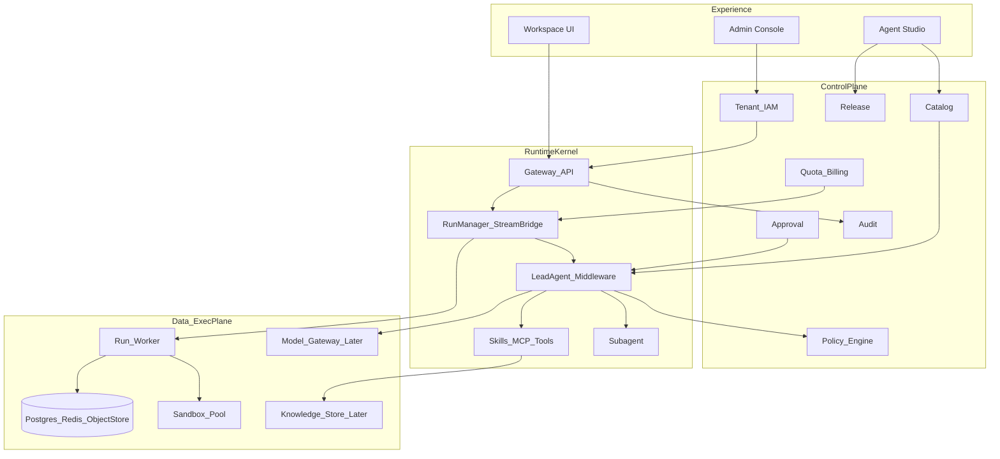
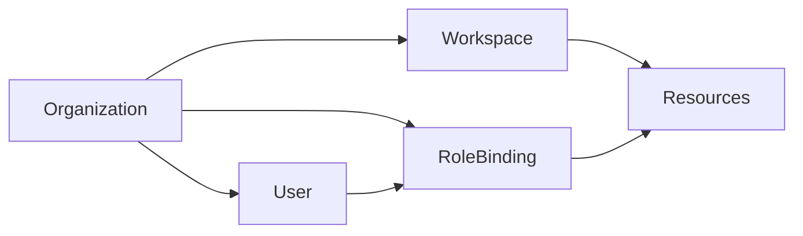
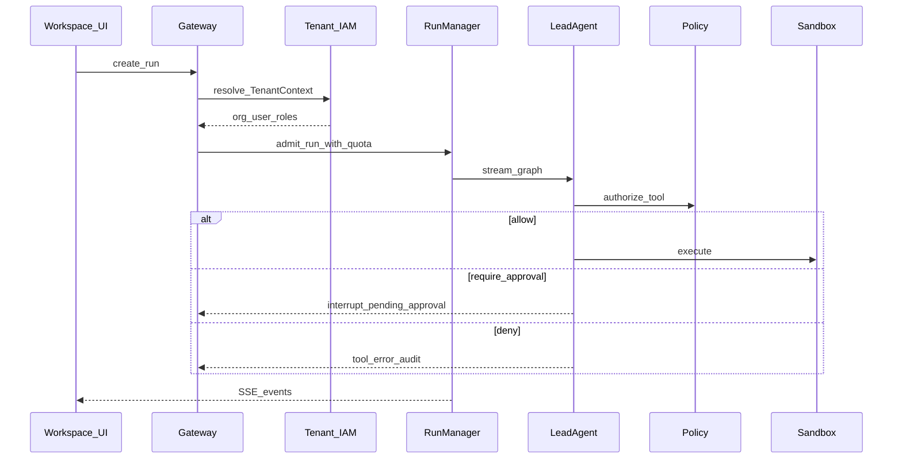
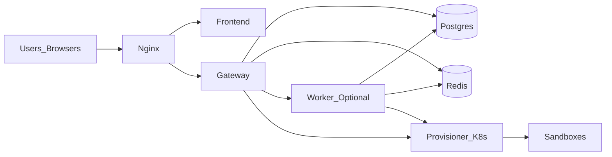

# DeerNexus 目标架构

> 状态：草案（MVP 蓝图）  
> 关联：[README](../../README.md) · [90 天 MVP](../roadmap/90-day-mvp.md) · [ADR-0001](../adr/0001-fork-evolution-strategy.md) · [ADR-0002](../adr/0002-tenant-workspace-keys.md) · [运行时契约](runtime-contracts.md) · [数据模型](data-model.md) · [API 边界](api-boundaries.md) · [安全基线](../security/baseline.md) · [生产 Runbook](../ops/production-runbook.md) · [测试策略](../engineering/testing-strategy.md)

本文定义 DeerNexus 作为 **Enterprise Agent OS** 的目标分层、复用边界、控制面/数据面契约与部署拓扑。实现以 DeerFlow Fork 渐进演进，优先保证「能落地、可观测、可隔离」，再扩展市场与独立 Model Gateway。

---

## 1. 定位

DeerNexus = **可治理的 Agent 执行操作系统**。

- **OS 内核**：调度 Run、装载 Agent 制品、隔离沙箱、装配工具/技能/MCP、流式交付结果。
- **控制面**：组织身份、权限、目录、策略、审批、配额、审计、发布。
- **体验层**：终端工作台 + 企业管理与 Studio。

它不是单次 Deep Research 应用，也不是无隔离的 Prompt 演示页。

---

## 2. 分层总览



| 层 | 职责 | 90 天态度 |
| --- | --- | --- |
| 体验层 | 工作台、企业控制台、Studio | Console UI + Studio 版本 MVP；Registry/市场延后 |
| 企业控制面 | 租户、IAM、Catalog、Policy、Approval、Quota、Audit、Release | Tenant/IAM/Audit/Catalog 元数据 + Agent 版本优先 |
| Agent 运行内核 | 图编排、中间件、工具装配、流式与检查点 | **强复用** DeerFlow harness |
| 执行与数据平面 | Worker、沙箱池、Postgres、Redis、对象存储 | 生产基线必选；KB / 独立 Model GW 后期 |

---

## 3. 源码与模块落点（目标）

继承 DeerFlow 的 **harness → app** 单向依赖：

```text
DeerNexus/
├── backend/
│   ├── packages/harness/deerflow/     # RuntimeKernel（Fork 上游，企业钩子最小化）
│   │   ├── agents/                    # Lead agent + middleware（复用）
│   │   ├── runtime/                   # RunManager, journal, stream_bridge（增强）
│   │   ├── sandbox/ / community/      # 沙箱抽象与实现（增强租户池）
│   │   ├── skills/ / mcp/ / models/   # 扩展装载（读 Catalog/Policy 契约）
│   │   └── contracts/                 # TenantContext, PolicyDecision, ReleaseRef...（新增）
│   └── app/
│       ├── gateway/                   # HTTP + LangGraph 兼容运行时入口（增强）
│       ├── control_plane/             # 企业控制面模块（新建）
│       │   ├── tenant/
│       │   ├── iam/
│       │   ├── catalog/
│       │   ├── policy/
│       │   ├── approval/
│       │   ├── quota/
│       │   ├── audit/
│       │   └── release/
│       ├── worker/                    # 可选独立 Run Worker（多副本后）
│       ├── channels/                  # IM（复用）
│       └── scheduler/                 # 定时任务（复用 + org 范围）
├── frontend/
│   └── src/app/
│       ├── workspace/                 # 终端用户（复用演进）
│       ├── admin/                     # 企业控制台（新建）
│       └── studio/                    # Agent Studio（新建，可晚于 admin）
└── docs/                              # 本目录文档体系
```

**硬约束**：`packages/harness/deerflow/` 不得 import `app.control_plane.*`。运行时只消费稳定契约（ContextVar / Protocol / DTO），控制面实现放在 `app/`。

---

## 4. 强复用清单

| 资产 | 典型路径（相对 DeerFlow） | DeerNexus 策略 |
| --- | --- | --- |
| Middleware 链 | `agents/lead_agent/`, `agents/middlewares/` | 保留顺序语义；外挂 Policy / Approval 中间件 |
| Run 生命周期 | `runtime/runs/`, `runtime/journal.py`, `stream_bridge/` | 租户标签 + 多副本 lease/cancel 闭环 |
| 沙箱 | `sandbox/`, `community/aio_sandbox/`, `boxlite/`, provisioner | 生产禁用 host bash；增租户池与 egress |
| Skills / MCP | `skills/`, `mcp/`, `extensions_config` | 纳入 Catalog 与安装审批 |
| Guardrails | `guardrails/` | 扩展为租户级 Policy 绑定 |
| 认证骨架 | `app/gateway/auth*`, OIDC | 升级 org 角色与服务账号；替换 flat permissions |
| 持久化 | `persistence/` + Alembic | 加 `org_id`；审计表；不可变制品表 |
| Console API | `app/gateway/routers/console.py` | 升至 org 聚合；前端补 UI |
| IM / 调度 / GitHub Agents | `app/channels/`, `scheduler/`, `gateway/github/` | 绑定 org 资源与审计 |

---

## 5. 控制面与数据面边界

### 5.1 控制面负责

- Organization / Workspace / Membership / RoleBinding
- 资源目录与审批态（Agent、Skill、MCP、Tool）
- Policy 定义、绑定、仿真（后期）、生效范围
- Approval 工单状态机与 SLA
- 配额、预算阈值、（后期）账单导出
- 审计查询、合规导出、运营 Console 聚合
- 发布通道：版本晋升、回滚、环境绑定

### 5.2 数据面负责

- 创建与执行 Run、StreamBridge SSE、checkpoint / store
- 工具调用、沙箱 acquire/release、workspace 变更扫描
- 模型调用与 token 计量写入 journal
- （后期）知识检索、模型路由代理

### 5.3 稳定契约（示例）

运行时只读以下概念（字段级定义见[运行时稳定契约](runtime-contracts.md)，后续落入 `deerflow.contracts`）：

| 契约 | 用途 |
| --- | --- |
| `TenantContext` | `org_id`, `workspace_id?`, `principal(PrincipalRef)`, `auth_method`, `request_id`, `trace_id`, `issued_at` |
| `PolicyDecision` | allow / deny / require_approval + reason + rule_id |
| `ApprovalTicket` | ticket_id + resume_token_ref + risk class |
| `ReleaseRef` | org/package/version/digest/channel；执行身份以 digest 为准 |
| `UsageRecord` | tokens / cost / model / org 归因 |
| `AuditEvent` | 不可篡改语义的操作证据（auth / config / tool_deny / data_access） |

请求路径上，Gateway 在认证后写入 `TenantContext`；Lead Agent / Worker 只消费上下文与策略结果，不直查控制面私有表。

### 5.4 MVP 边界决策

- `Policy` 箭头表示通过 `PolicyEvaluator` Protocol 调用，不表示 harness 依赖控制面实现；MVP 优先进程内 Adapter，不拆独立 Policy 服务。
- 普通装载与 Run admission 在创建 Run 时记录策略版本；高风险工具、外部写入、网络和凭证访问逐次实时评估并 fail-closed。
- `Quota` 在 MVP 只保留 admission 接口、用量归因和 deny 审计，不交付账单、预算 UI 或 chargeback。
- 图中的 Worker 在 MVP 是逻辑执行角色，可以仍内嵌 Gateway；物理拆分由后续 ADR 和容量指标决定。
- `prod` 的唯一执行权威是不可变 AgentVersion / ReleaseRef；文件系统 Agent 仅作开发态或导入源。

---

## 6. 身份与隔离模型



- **Organization**：硬隔离与默认计费边界。
- **Workspace**（可选）：项目命名空间；配额与发布可挂在此层。
- **User / Service Account**：主体；权限来自 RoleBinding，而非全局 `_ALL_PERMISSIONS`。
- **IM `workspace_id`**：保留为外部平台字段，**禁止**复用为平台 Workspace 主键。

最小角色（MVP）：`org:admin`、`org:developer`、`org:viewer`；平台 `system:admin` 单独保留。

---

## 7. 关键数据流

### 7.1 用户对话 Run



### 7.2 Agent 发布（Studio）

1. 开发者提交制品 → Catalog `draft`
2. SkillScan / 静态检查 → `reviewed`
3. （可选）企业审批通过；AgentVersion 状态仍为 `reviewed`
4. Release 晋升到 channel（`staging` / `prod`），版本进入 `published`
5. Run 只解析不可变 `ReleaseRef`，禁止静默读“磁盘最新草稿”

---

## 8. 部署拓扑（目标）



**生产硬要求**：

- Postgres（SQL 仓储 + checkpointer / store）
- Redis StreamBridge + run ownership heartbeat（多副本前提）
- 生产沙箱（AIO / BoxLite / K8s Provisioner），禁止 `allow_host_bash`
- OIDC（或企业本地登录）开启，fail-closed

**演进**：

1. MVP：Gateway 仍内嵌执行（对齐上游），但完成 multi-worker lease/cancel。
2. 规模化：拆 `app/worker`，Gateway 变薄；外置托管 Postgres/Redis；对象存储承载大制品。
3. 后期：独立 Model Gateway、向量库、Webhook 事件总线。

---

## 9. 与 90 天交付的映射

| 架构能力 | 0–30 | 31–60 | 61–90 |
| --- | --- | --- | --- |
| 生产基线 / multi-worker 语义 | lease/cancel/reconcile 语义必做；生产 replicas≥2 条件启用 | 加固 | 按 Runbook 验收 |
| TenantContext 贯穿 | 骨架 | 强制入库过滤 | 全路径验收 |
| 真实 RBAC | 设计 | 落地 | Console 鉴权 |
| AuditEvent | 事件骨架 | 写入路径 | 查询 UI |
| Catalog + Agent 版本 | 元模型 | 存表 | Studio/发布 MVP |
| Console UI | API 对齐 | | org 级页面 |
| Policy / Approval / Quota 完整产品化 | 不做 | 钩子预留 | 仅最小deny审计 |
| KB / Registry 市场 / 账单 | 非目标 | 非目标 | 非目标 |

细节见 [90 天 MVP](../roadmap/90-day-mvp.md)。

---

## 10. 非目标（本蓝图明确不做）

- 重写 LangGraph middleware 链或另起 Agent 框架
- 以 Memory JSON 冒充企业知识库
- 用澄清卡片替代合规审批中心
- 首期独立 SaaS 计费开票系统与公共市场
- 首期全球多活 DR（仅要求备份与单区域恢复文档）

---

## 11. 配套文档

已补充：

1. [运行时稳定契约](runtime-contracts.md)：TenantContext、Policy、ReleaseRef、AuditEvent、UsageRecord
2. [MVP 数据模型](data-model.md)：Org、RBAC、Agent 制品、审计及资源归属
3. [API 边界](api-boundaries.md)：Runtime、Admin、Studio、Internal API
4. [ADR-0002](../adr/0002-tenant-workspace-keys.md)：租户主键与 Workspace 语义
5. [生产安全基线](../security/baseline.md)：身份、隔离、Secret、Sandbox、SSRF、供应链
6. [生产 Runbook](../ops/production-runbook.md)：部署、迁移、备份恢复、双副本与故障处理
7. [测试策略](../engineering/testing-strategy.md)：隔离、契约、迁移、发布、安全与恢复门禁
8. [ADR-0003](../adr/0003-rbac-and-service-accounts.md)：RBAC、服务账号、API Key 与撤权
9. [ADR-0004](../adr/0004-agent-artifacts-and-release.md)：不可变 Agent 制品、通道与回滚
10. [ADR-0005](../adr/0005-audit-event.md)：AuditEvent、可靠写入、防改写与保留
11. [可观测性与 SLO](../ops/observability-and-slo.md)：日志、指标、Trace、告警与错误预算
12. [CI/CD](../engineering/ci-cd.md)：流水线、制品、迁移与环境晋升
13. [上游同步](../engineering/upstream-sync.md)：DeerFlow 基线、同步节奏与分叉度量
14. [ADR-0006](../adr/0006-gateway-worker-split.md)：Gateway / Worker 物理拆分条件
15. [威胁模型](../security/threat-model.md)：STRIDE、Abuse Case、控制追踪与残余风险
16. [数据治理](../compliance/data-governance.md)：分类、用途、保留、删除与合规证据
17. [容量与灾备](../ops/capacity-and-dr.md)：实测容量、扩容阈值、RPO / RTO 与演练
18. [PR 拆分指南](../engineering/pr-split-guide.md)：大改造的依赖顺序、粒度与回滚
