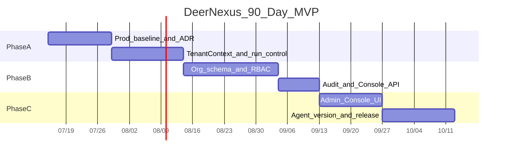

# DeerNexus 90 天 MVP 路线图

> 状态：可执行草案  
> 关联：[README](../../README.md) · [目标架构](../architecture/target-architecture.md) · [ADR-0001](../adr/0001-fork-evolution-strategy.md) · [ADR-0002](../adr/0002-tenant-workspace-keys.md) · [运行时契约](../architecture/runtime-contracts.md) · [数据模型](../architecture/data-model.md) · [API 边界](../architecture/api-boundaries.md) · [安全基线](../security/baseline.md) · [生产 Runbook](../ops/production-runbook.md) · [测试策略](../engineering/testing-strategy.md)

**目标**：在 90 天内建成「不会反复推倒」的企业 Agent OS 基座——生产可运行、组织可隔离、操作可审计、Agent 可版本发布。  
**不以**建成完整市场、计费或知识库为验收。

---

## 0. 成功定义

90 天结束时必须同时满足：

| # | 验收标准 |
| --- | --- |
| 1 | 生产拓扑默认可声明：Postgres + Redis + OIDC + 非 host bash 沙箱 |
| 2 | 双组织数据互不可见；同组织内角色权限生效（非 flat permissions） |
| 3 | 运行时契约 §10 的 MVP 必报 `AuditEvent` 全部可写、可按 Org 查询，包含审批预留与发布回滚 |
| 4 | 管理员可在 `/admin` 查看 **组织级** Console（stats / runs / usage） |
| 5 | Agent 存在不可变版本；`prod` 只解析已发布 `ReleaseRef`，拒绝 legacy unpinned Run，并可回滚 |
| 6 | 隔离、harness 边界、Runtime 契约、prod ReleaseRef 及[安全基线“供应链与 CI/CD”](../security/baseline.md#13-供应链与-cicd)扫描进入 CI 门禁 |
| 7 | 生产 doctor 无 FAIL；安全基线不可豁免项零缺口，其余项全部通过或有有效豁免 |
| 8 | 至少完成一次备份恢复演练，满足声明 RPO（日备≤24h；启用 PITR≤15min）和 RTO≤4h |

**总原则**：Tenant Context → RBAC → Catalog / Audit / Release。绕过顺序先做市场或计费，视为失败。

---

## 1. 全局非目标（90 天内明确不做）

- 公共 / 付费 Skill 市场与制品签名供应链完整方案
- 独立 Model Gateway 服务与多供应商智能路由
- 企业知识库摄取管道与向量检索产品化
- 多级审批中心完整产品（仅允许策略钩子与「require_approval」预留）
- SaaS 账单、发票、chargeback
- 跨区域多活；Gateway 与 Worker 强制物理拆分（可作为可选 spike，非验收项）
- 用 IM 的 `workspace_id` 当作平台 Workspace

---

## 2. 阶段总表

| 阶段 | 窗口 | 主题 | 关键交付 | 出口验收 |
| --- | --- | --- | --- | --- |
| Phase A | 0–30 天 | 生产基线与租户 ADR | 部署基线、TenantContext 骨架、多副本 run-control 推进 | 上下文可在请求/run 路径读取；双副本按条件门槛验收 |
| Phase B | 31–60 天 | 组织、RBAC、审计 | Org 模型、真实权限、审计落库、Console API org 聚合 | 跨组织隔离测试绿；审计可检索 |
| Phase C | 61–90 天 | Console UI + Agent 版本 | Admin UI、AgentPackage、channel 发布与回滚 | `/admin` 可用；prod 只跑已发布版本 |

---

## 3. Phase A（0–30 天）：生产基线与 Tenant ADR

### 3.1 目标

把 DeerFlow fork 调到「企业可部署」默认姿态，并冻结租户主键设计，避免后续全表返工。

### 3.2 交付物

| ID | 交付物 | 责任模块 | 依赖 | 验收 |
| --- | --- | --- | --- | --- |
| A1 | 生产配置清单与 doctor 检查项 | 生产 Runbook / `scripts` 对齐 | 无 | Postgres/Redis/OIDC/沙箱/备份有检查；错误配置可被检测或明确警告 |
| A2 | Fork 与租户主键 ADR 定稿 | `docs/adr` | 本目录 | ADR-0001、ADR-0002 Accepted，且被 README/架构引用 |
| A3 | `TenantContext` 设计 + ContextVar 骨架 | `deerflow.contracts` 或 `runtime` + Gateway | A2 | 测试证明请求可绑定 org/user；默认迁移路径明确（如单租户 bootstrap） |
| A4 | Multi-worker run control 推进 | `runtime/runs`、`run_ownership`、StreamBridge | Postgres+Redis | cancel / lease / reconcile 核心路径有测试；Helm 文档更新双副本前提 |
| A5 | 生产安全与沙箱策略 | security baseline、sandbox config | A1 | 禁用 host bash；身份、Secret、SSRF、Sandbox 阻断项可验收 |
| A6 | Feature 暴露 | `features` API + 前端门控 | 无 | Console / agents / scheduler 等开关对 UI 可见 |
| A7 | MVP 实施与生产规格冻结 | `docs/architecture`、`security`、`compliance`、`ops`、`engineering` | A2 | Contracts、Data Model、API、Security、Threat、Governance、Runbook、Capacity/DR、Testing、Observability、CI/CD、Upstream、PR Guide 与 ADR 一致 |

### 3.3 风险

| 风险 | 缓解 |
| --- | --- |
| 上游 #3948 类 run-control 未完成阻塞多副本 | 采用条件门槛：若启用 replicas≥2，必须通过一致性测试；否则锁定 replicas=1、登记正式豁免且不宣称 HA |
| 过早铺满 org 表无上下文契约 | 先冻结 `TenantContext` 字段与解析点，再写迁移 |

### 3.4 Phase A 出口检查清单

- [ ] 开发与预发可用同一套「企业最小配置」启动
- [ ] TenantContext 解析点清单（Gateway / worker / scheduled / channel）已文档化
- [x] Organization / Workspace 主键与资源归属由 ADR-0002 冻结
- [x] 运行时契约、MVP 数据模型与 API 边界形成实施草案
- [x] 安全基线、生产 Runbook 与测试策略形成 MVP 强制规格
- [x] ADR-0003 / 0004 / 0005、可观测性、CI/CD 与上游同步规范已冻结
- [x] ADR-0006、威胁模型、数据治理、容量与灾备、PR 拆分指南已形成实施基线
- [ ] Fork 后按上游真实表、路由和 Runtime 结构校准实施草案
- [ ] 若启用双副本，滚动重启、cancel、lease、reconcile 测试通过；否则部署配置锁定单副本并记录豁免

---

## 4. Phase B（31–60 天）：租户、RBAC、审计

### 4.1 目标

从「用户隔离」升级为「组织隔离」，并用真实角色替换「已认证即全权限」。

### 4.2 交付物

| ID | 交付物 | 责任模块 | 依赖 | 验收 |
| --- | --- | --- | --- | --- |
| B1 | 数据模型与迁移 | `organizations`, `org_memberships`, `roles`, `role_bindings`；资源表加 `org_id` | A3、A7 | Alembic 可升级；存量用户可迁入默认 org |
| B2 | 真实 RBAC | `app/control_plane/iam` + `authz.py` 改造 | B1、[ADR-0003](../adr/0003-rbac-and-service-accounts.md) | `org:admin/developer/viewer` 生效；无权操作 403/404 符合约定 |
| B3 | SSO 映射最小版 | OIDC groups → roles（可配置） | B2 | 至少一个 IdP 映射路径可测 |
| B4 | 服务账号 / API Key（最小） | `api_keys` + 鉴权中间件 | B2 | 机器调用可创建 run 且归因到 org；密钥不明文落盘 |
| B5 | `AuditEvent` 管道 | `app/control_plane/audit` + journal/guardrail 钩子 | B2、[ADR-0005](../adr/0005-audit-event.md) | 规定事件类型可写入并按 org 查询 |
| B6 | Console API org 范围 | `routers/console.py` 扩展 | B1 | stats/runs/usage 按 org 过滤；越权不可读 |

### 4.3 建议最小 Schema（示意）

```text
organizations(id, name, slug, created_at, ...)
org_memberships(id, org_id, user_id, status, ...)
roles(id, org_id nullable for system, name, permissions[])
role_bindings(org_id, principal_type, principal_id, role_id)
audit_events(id, org_id, actor_id, action, resource_type, resource_id, payload, created_at)
```

资源侧（threads_meta / runs / agents / scheduled_tasks 等）增加 `org_id`；查询默认带 org 过滤。

### 4.4 风险

| 风险 | 缓解 |
| --- | --- |
| 遗漏路径导致跨 org 泄露 | 对 Phase B 已实现资源执行测试策略 §6 全矩阵；Phase C 新增 release 资源后补齐最终矩阵 |
| 权限装饰器与中间件双轨不一致 | 单一权限解析函数；路由只调该函数 |

### 4.5 Phase B 出口检查清单

- [ ] ADR-0003 不晚于 Day 60 Accepted；此前以测试策略 §9.1 临时矩阵 v0.1 为权威
- [ ] 双 org 集成测试覆盖 Phase B 已实现的 thread、run、checkpoint、memory、artifact、skill、MCP、scheduled task、API key、console、audit
- [ ] 管理员操作与工具拒绝有审计记录
- [ ] 文档：如何创建组织、邀请成员、绑定角色

---

## 5. Phase C（61–90 天）：Console UI 与 Agent 版本 MVP

### 5.1 目标

让控制面「可见、可用」；让生产 Agent 绑定不可变制品。

### 5.2 交付物

| ID | 交付物 | 责任模块 | 依赖 | 验收 |
| --- | --- | --- | --- | --- |
| C1 | `/admin` Console UI | `frontend/src/app/admin` | B6 | 登录 org 管理员可看跨 thread runs、用量、失败摘要 |
| C2 | Agent 制品模型 | `agent_packages` + `agent_versions`（version、digest、manifest、status） | B1、[ADR-0004](../adr/0004-agent-artifacts-and-release.md) | 同 package 多 version；草稿与已发布分离；已发布内容不可变 |
| C3 | Release Channel | `dev` / `staging` / `prod` + 晋升/回滚 API | C2、[ADR-0004](../adr/0004-agent-artifacts-and-release.md) | prod 运行只解析已发布版本；回滚后下一 run 生效 |
| C4 | 发布管理 API + 可选 Studio 最小 UI | `studio` 或 admin 子页 | C2–C3 | API-first 完成发布回滚；前端资源允许时补最小 UI |
| C5 | Catalog 元数据只读镜像 | control_plane catalog | C2 | file-based agent/skill 可导入目录；prod 执行仍只解析不可变 ReleaseRef |
| C6 | 文档、实现映射与演示脚本 | docs + 示例配置 | C1–C5 | Day 75 前补齐 Runbook §17 真实命令、配置、Dashboard、Owner；验收剧本可复现 |

### 5.3 Policy / Approval（仅预留）

- Guardrail deny 写入 AuditEvent（已在 B5）
- 预留 `PolicyDecision.require_approval` 字段与 interrupt 扩展点
- **不交付**审批待办 UI、会签流、SLA

### 5.4 风险

| 风险 | 缓解 |
| --- | --- |
| 磁盘 Agent 与 DB 制品双写混乱 | 明确「prod = ReleaseRef」；文件系统只作开发态或导入源，dev 草稿必须显式打标 |
| Admin UI 范围蔓延 | 严格只做 Console + 版本；连接器中心下沉下一季度 |

### 5.5 Phase C 出口检查清单

- [ ] 演示：两 org、两角色、一次拒绝工具、一次 Agent v1→v2→回滚
- [ ] 测试策略 §6 的 12 类资源最终隔离矩阵全部通过
- [ ] README / 架构 / ADR 与真实行为一致
- [ ] 下一季度 backlog 已按非目标拆分（KB、审批中心、计费、市场）

---

## 6. 建议里程碑节奏（周级）



> 上图日期仅为相对示例；实际以项目启动日记为 Day 0。

---

## 7. 团队分工建议（最小）

| 角色 | Phase A | Phase B | Phase C |
| --- | --- | --- | --- |
| 平台后端 | 基线、run-control、契约 | 模型、RBAC、审计 | 发布 API |
| 运行时 | lease/cancel、上下文贯穿 | org 过滤仓储 | ReleaseRef 解析 |
| 前端 | features 门控 | — | `/admin` + 发布流 |
| 安全/运维 | 安全基线、Runbook、doctor | SSO、隔离、备份恢复演练 | 发布准入、告警与验收证据 |

人数不足时可合并「平台后端 + 运行时」，但 **隔离回归测试** 不可省。

---

## 8. 度量（过程指标）

| 指标 | 目标（90 天末） |
| --- | --- |
| 跨 org 隔离测试用例 | ≥ 约定核心资源全覆盖且 CI 绿灯 |
| Audit 覆盖写路径 | 清单中 100% 有事件或明确豁免理由 |
| 从草稿到 prod 回滚演练 | 成功 1 次并留下记录 |
| 双副本 Gateway（若已解锁） | 滚动重启无卡死 Run；否则锁定 replicas=1、记录豁免且不宣称 HA |
| 架构边界与契约 | harness boundary、OpenAPI / Runtime contracts 在 CI 绿灯 |
| 生产配置 | doctor 无 FAIL；安全不可豁免项零缺口 |
| 备份恢复 | 至少 1 次，记录实际 RPO / RTO 并满足 MVP 目标 |

---

## 9. 90 天之后（占位，不排期）

按架构蓝图继续：

1. **Phase 2+**：Policy 绑定产品化、审批中心、连接器凭证保险库  
2. **知识面**：KB 摄取与 Memory/MCP 分工  
3. **商业化**：Quota 强制、账单导出、私有 Registry、签名  
4. **规模化**：Worker 拆分、HPA/PDB、季度 DR 与跨故障域恢复

---

## 10. 变更规则

- 新增「必做」必须同步改本文件验收表与非目标表，并由 ADR 或变更记录说明理由。  
- 砍掉隔离、审计、ReleaseRef 三类能力之一，视为 MVP 失败而不是延期同级项。
